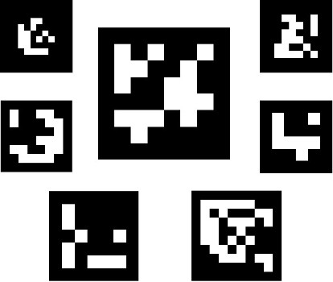

# Aruco Markers

**ArUco markers** are binary square fiducial **markers** that can be used for camera pose estimation. Their main benefit is that their detection is robust, fast and simple. The **aruco** module includes the detection of these types of **markers** and the tools to employ them for pose estimation and camera calibration.

