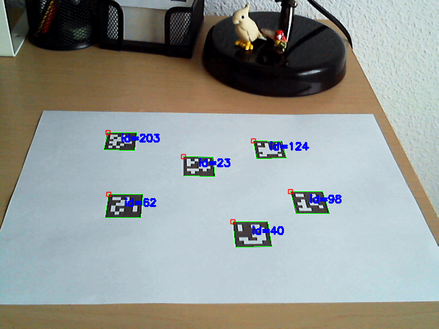

# Detection of Aruco markers

Pose estimation is of great importance in many computer vision applications: robot navigation, augmented reality, and many more. This process is based on finding correspondences between points in the real environment and their 2d image projection. This is usually a difficult step, and thus it is common the use of synthetic or fiducial markers to make it easier.

One of the most popular approach is the use of binary square fiducial markers. The main benefit of these markers is that a single marker provides enough correspondences \(its four corners\) to obtain the camera pose. Also, the inner binary codification makes them specially robust, allowing the possibility of applying error detection and correction techniques.

### Markers and Dictionaries

An ArUco marker is a synthetic square marker composed by a wide black border and a inner binary matrix which determines its identifier \(id\). The black border facilitates its fast detection in the image and the binary codification allows its identification and the application of error detection and correction techniques. The marker size determines the size of the internal matrix. For instance a marker size of 4x4 is composed by 16 bits.

The main properties of a dictionary are the dictionary size and the marker size.

* The dictionary size is the number of markers that composed the dictionary.
* The marker size is the size of those markers \(the number of bits\).

### Marker Detection

Given an image where some ArUco markers are visible, the detection process has to return a list of detected markers. Each detected marker includes:

* The position of its four corners in the image \(in their original order\).
* The id of the marker.

#### Python Code for Aruco Detection

```text
import numpy as np
import cv2
import cv2.aruco as aruco

#opening front cam 
cap = cv2.VideoCapture(0)

#Running loop for each frame   
while(True):
    # Capture frame-by-frame
    ret, frame = cap.read()
    #print(frame.shape) #480x640
    # Our operations on the frame come here
    #converting the image to grayscale 
    gray = cv2.cvtColor(frame, cv2.COLOR_BGR2GRAY)
    aruco_dict = aruco.Dictionary_get(aruco.DICT_6X6_250)
    parameters =  aruco.DetectorParameters_create()

    corners, ids, rejectedImgPoints = aruco.detectMarkers(gray, aruco_dict, parameters=parameters)
    print(corners)

    gray = aruco.drawDetectedMarkers(gray, corners)

    cv2.imshow('frame',gray)
    if cv2.waitKey(1) & 0xFF == ord('q'):
        break
 
# When everything done, release the capture
cap.release()
cv2.destroyAllWindows()
```



#### C++ code For Aruco Detection

```text
#include <opencv2/opencv.hpp>
#include <opencv2/aruco.hpp>
#include<bits/stdc++.h>
using namespace std;

int main(int argc, char **argv)
{
    int wait_time = 10;
    cv::VideoCapture in_video;
    in_video.open(0);
    cv::Ptr<cv::aruco::Dictionary> dictionary = cv::aruco::getPredefinedDictionary( cv::aruco::DICT_6X6_250);
    
    while (in_video.grab()) 
    {
        cv::Mat image, image_copy;
        in_video.retrieve(image);
        std::vector<int> ids;
        std::vector<std::vector<cv::Point2f> > corners;
        cv::aruco::detectMarkers(image, dictionary, corners, ids);

        // if at least one marker detected
        if (ids.size() > 0)
        {
            image =drawDetectedMarkers(image,corners);
        }
        cv::imshow("Detected markers",image);
        char key = (char) cv::waitKey(wait_time);
        if (key == 27)
            break;
    }

    in_video.release();
}
```

